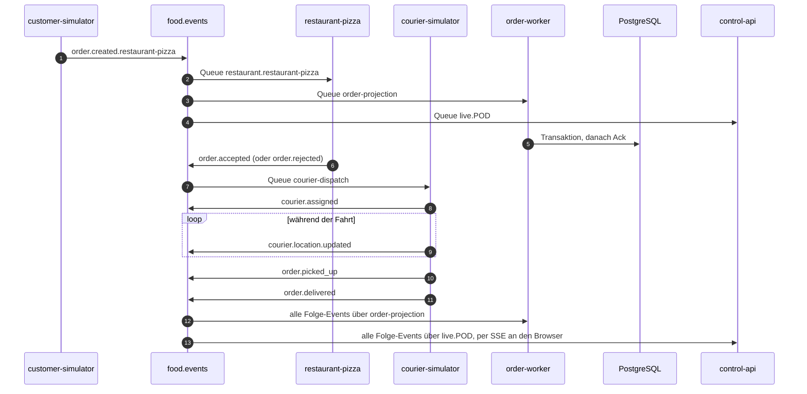
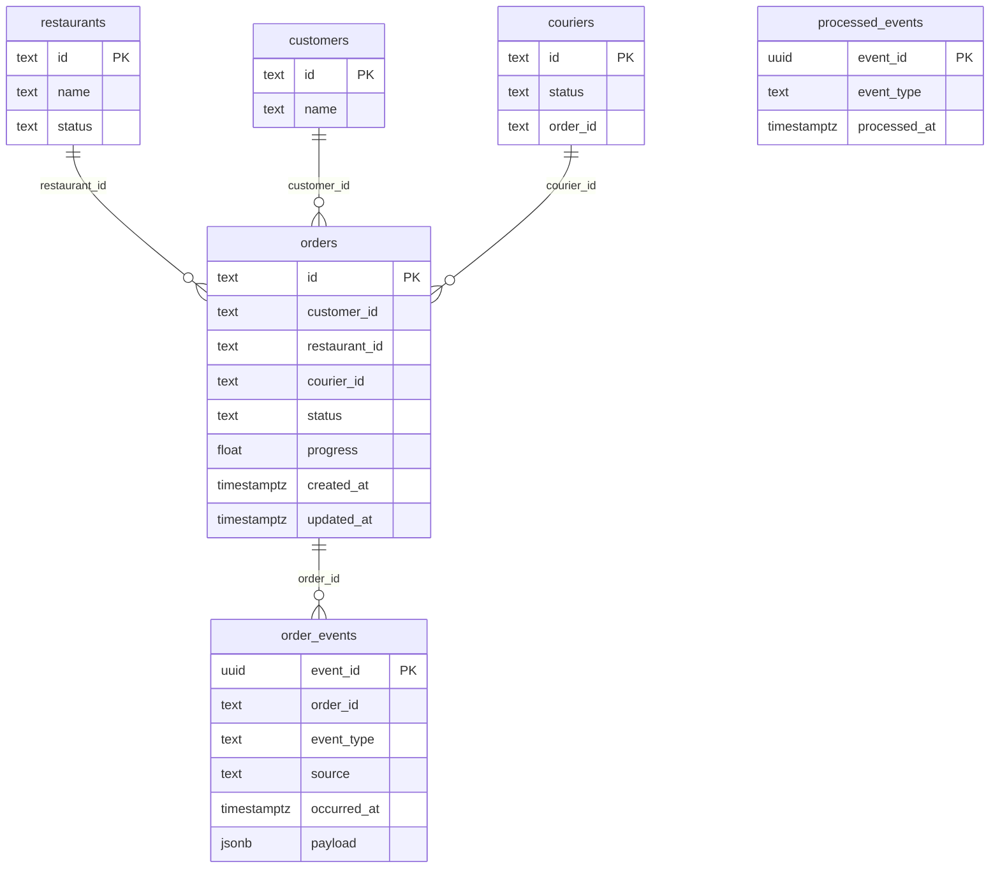

# Architektur

Dieses Dokument beschreibt den finalen Stand nach Block 7: Komponenten,
Eventfluss, Datenhaltung und die wichtigsten Entscheidungen. Am Ende steht, wie
sich die Architektur über die Ausbaustufen entwickelt hat.

Alle Namen von Queues, Events, Tabellen und Services sind aus dem Code und den
Manifesten übernommen, nicht nachträglich vereinfacht.

## 1. Komponenten

Das Diagramm liegt separat in [komponenten.md](komponenten.md), damit es sich
in voller Breite anschauen lässt.

| Komponente | Workload | Rolle |
| --- | --- | --- |
| `dashboard` | Deployment, 2 Replikas | Nuxt 4 und PixiJS; rendert Stadt und Systemansicht, hält selbst keinen Zustand |
| `control-api` | Deployment, 2 Replikas (bis Block 5: 1) | REST- und SSE-Schnittstelle zum Browser; jede Replika empfängt alle Events über ihre eigene Live-Queue und lädt den Stand alle 10 s aus PostgreSQL |
| `customer-simulator` | StatefulSet | registriert Kunden und erzeugt Bestellungen (`order.created`) |
| `restaurant-*` | 3 Deployments desselben Images | je ein Restaurant; nimmt Bestellungen an oder lehnt sie ab |
| `courier-simulator` | StatefulSet | registriert Kuriere, übernimmt angenommene Bestellungen, fährt und liefert |
| `order-worker` | Deployment, 2 Replikas | einziger Schreiber des fachlichen Zustands in PostgreSQL |
| `migrate` | Job | legt das Schema an, bevor der Order Worker schreibt |
| `cluster-observer` | Deployment | liest Pods und Workloads im Namespace für die Systemansicht |
| `rabbitmq` | StatefulSet, 1 Replika, PVC 1 Gi | Broker mit Management-UI und Prometheus-Plugin |
| `food-delivery-db` | CNPG `Cluster`, 2 Instanzen, je PVC 1 Gi | PostgreSQL 18.4, Primary und Standby auf verschiedenen Nodes |
| Monitoring | Helm-Release `monitoring` | kube-prometheus-stack 88.1.3 mit ServiceMonitors, PodMonitor und Grafana-Dashboard |

## 2. Eventfluss

### Topologie

Alle Producer publizieren auf den Topic-Exchange `food.events`. Jeder Consumer
deklariert seine eigene Queue und bindet sie mit einem Routing-Key-Muster.
Nachrichten, die ein Consumer ablehnt, leitet RabbitMQ über den
Dead-Letter-Exchange `food.dlx` in die Queue `food.dead`.

| Queue | Consumer | Binding | Parallelität |
| --- | --- | --- | --- |
| `restaurant.<id>` | `restaurant-<id>` | `order.created.<id>` | 1 Pod, skalierbar |
| `courier-dispatch` | `courier-simulator` | `order.accepted` | 1 Worker, Prefetch 1 |
| `order-projection` | `order-worker` | `order.#`, `courier.#`, `customer.#`, `simulation.#` | 2 Pods × 2 Worker, Prefetch 16 |
| `live.<pod>` | `control-api` | `#` | exklusiv, auto-delete |
| `simulation-control.<pod>` | `customer-simulator` | `simulation.#` | auto-delete |
| `food.dead` | – | `#` auf `food.dlx` | Sammelstelle für abgelehnte Nachrichten |

Im finalen Stand sind das neun Queues: drei Restaurant-Queues, je eine für
Kurier-Dispatch, Projektion und Simulationssteuerung, zwei Live-Queues (eine
pro `control-api`-Replika) sowie die DLQ. Im Block-5-Lab mit nur einer
API-Replika waren es acht.

### Ablauf einer Bestellung

Jedes Event ist in einen Envelope mit `event_id`, `event_type`,
`event_version`, `occurred_at`, `correlation_id`, `causation_id`, `source` und
typisiertem `payload` verpackt. Die `correlation_id` ist die Order-ID; über sie
lassen sich alle Events einer Bestellung zusammenführen.

Weitere Events: `customer.registered`, `courier.registered` beim Start der
Simulatoren sowie `simulation.started`, `simulation.paused` und
`simulation.reset` aus der Steuerung des Dashboards.

### Zustellgarantie und Fehlerbehandlung

Die Verarbeitung ist **at-least-once**. Ein Consumer bestätigt eine Nachricht
erst, wenn sein Handler erfolgreich war. Stirbt ein Pod dazwischen, stellt
RabbitMQ die unbestätigte Nachricht erneut zu.

| Situation | Reaktion des Consumers | Ergebnis |
| --- | --- | --- |
| Handler erfolgreich | `Ack` | Nachricht entfernt |
| Body ist kein gültiges JSON | `Nack`, ohne Requeue | direkt in `food.dead` |
| Handler meldet Fehler | `Nack`, ohne Requeue | direkt in `food.dead` |
| Pod wird beendet (Kontext abgebrochen) | `Nack`, mit Requeue | erneute Zustellung an einen anderen Consumer |
| Pod stirbt ohne Antwort | – | RabbitMQ stellt nach Verbindungsabbruch neu zu |

Eine ungültige Nachricht erscheint mehrfach in `food.dead`, weil jede Queue,
deren Binding passt, eine eigene Kopie erhält und jede Kopie einzeln abgelehnt
wird. Im Block-5-Lab waren es drei Kopien.

## 3. Datenhaltung

### Wo welcher Zustand liegt

| Ort | Inhalt | Überlebt Pod-Neustart | Überlebt Namespace-Löschung |
| --- | --- | --- | --- |
| PostgreSQL (`food-delivery-db`) | fachlicher Zustand: Orders, Kunden, Kuriere, Restaurants, Event-Historie | ja, PVC | nein |
| RabbitMQ (`data-rabbitmq-0`) | noch nicht verarbeitete Nachrichten, Queue-Definitionen | ja, PVC | nein |
| `control-api` im Speicher | Anzeige-Zustand für SSE und Snapshot | nein, wird aus PostgreSQL rekonstruiert | – |
| Dashboard | nichts | – | – |

### Schema

`processed_events` steht bewusst ohne Beziehung: die Tabelle hält jede je
verarbeitete `event_id` fest, unabhängig davon, ob das Event eine Bestellung
betrifft. Die Fremdschlüssel im Diagramm sind logisch, nicht als Constraint
angelegt.

### Idempotente Projektion

Der Order Worker verarbeitet jedes Event in genau einer Transaktion:

1. `INSERT INTO processed_events … ON CONFLICT (event_id) DO NOTHING`.
   Kommt keine Zeile zurück, war das Event schon verarbeitet; der Worker
   bestätigt die Nachricht und tut sonst nichts.
2. Bestellbezogene Events zusätzlich in `order_events` anhängen.
   Positions-, Registrierungs- und Simulations-Events gehören nicht zur
   Historie einer Bestellung und werden dort nicht abgelegt.
3. Den fachlichen Zustand per Upsert in `orders`, `couriers`, `customers`
   und `restaurants` projizieren.
4. Committen und erst danach `Ack` an RabbitMQ.

Doppelte Zustellungen sind bei at-least-once der Normalfall, keine Ausnahme.
Durch die Reihenfolge dieser Schritte kann eine zweite Zustellung weder eine
Zeile doppelt anlegen noch einen Status zurücksetzen.

### Replikation und Failover

CloudNativePG betreibt zwei Instanzen mit **asynchroner** Streaming-Replikation.
Die Pod-Anti-Affinity ist `required`, Primary und Standby liegen damit zwingend
auf verschiedenen Nodes.

| Service | Ziel | Verwendet von |
| --- | --- | --- |
| `food-delivery-db-rw` | aktueller Primary | `order-worker`, `control-api`, `migrate` |
| `food-delivery-db-ro` | Standby | nicht verwendet |
| `food-delivery-db-r` | alle Instanzen | nicht verwendet |

Im Failover-Test (Force-Delete des Primary) zeigte `food-delivery-db-rw` nach
33,5 Sekunden auf den bisherigen Standby, ohne Änderung an einer Anwendung.

## 4. Wichtigste Entscheidungen

**E1 – `control-api` erst singleton, ab Block 6 mit zwei Replikas.**
In Block 3 bis 5 hält die API ihren Zustand nur im Speicher; zwei Replikas
würden zwei verschiedene Städte zeigen, je nachdem, welchen Pod der Service
gerade trifft. Sie bleibt deshalb bewusst bei einer Replika. Ab Block 6 ist
PostgreSQL die Quelle der Wahrheit: jede Replika lädt beim Start und danach
alle 10 Sekunden den Stand aus der Datenbank und erhält Live-Events über ihre
eigene exklusive Queue. Damit ist die API zustandslos genug für zwei Replikas.
Die verbleibende Unschärfe: zwei Replikas können sich bis zum nächsten
Nachladen kurz unterscheiden, wenn eine ein Live-Event verpasst hat.

**E2 – Topic-Exchange mit Routing-Key pro Restaurant.**
`order.created.<restaurant-id>` erlaubt jedem Restaurant eine eigene Queue.
Ein viertes Restaurant braucht nur ein weiteres Deployment, keine Änderung an
Producer oder Exchange. Konsumenten wie der Order Worker binden per Wildcard
`order.#` und erhalten alle Bestellungen unabhängig vom Restaurant.

**E3 – Competing Consumers statt Partitionierung.**
Mehrere Pods desselben Restaurants teilen sich eine Queue, RabbitMQ verteilt
reihum. Im Block-5-Lab baute das Hochskalieren von 0 auf 2 Pods einen
Rückstau von 8 Nachrichten vollständig ab.

**E4 – Ack erst nach dem Commit, Idempotenz in der Datenbank.**
Andersherum könnte ein Absturz zwischen Ack und Commit ein Event verlieren.
Die Kehrseite, doppelte Zustellungen, fängt `processed_events` ab. Die
Idempotenz liegt bewusst in derselben Transaktion wie die Zustandsänderung
und nicht in einem separaten Cache.

**E5 – Kein Retry mit Verzögerung, Fehler gehen direkt in die DLQ.**
Ein Handler-Fehler führt zu `Nack` ohne Requeue. Damit kann eine fehlerhafte
Nachricht keine Endlosschleife auslösen, die den Consumer blockiert. Nur ein
geordneter Pod-Abbruch stellt die Nachricht zurück. Diese Wahl ist einfach,
behandelt aber auch vorübergehende Fehler wie einen kurzen Datenbank-Ausfall
als endgültig. Siehe Reflexion.

**E6 – Ein einziger Schreiber für den fachlichen Zustand.**
Nur der Order Worker schreibt in PostgreSQL. Alle anderen Komponenten
publizieren Events. Das vermeidet konkurrierende Schreiber mit
unterschiedlichen Sichten auf dieselbe Bestellung.

**E7 – Datenbankzugriff nur über den Service `-rw`.**
Ein Pod-Name kennt seine Rolle nicht; nach einem Failover wäre der frühere
Primary ein Nur-Lese-Knoten und jedes `INSERT` schlüge fehl. Der Service folgt
dem Label, das der Operator umhängt.

**E8 – Operator statt eigenem StatefulSet für PostgreSQL.**
Helm installiert den Operator einmalig, der Operator betreibt danach laufend
Failover, Services und Secrets. Ein selbst gebautes StatefulSet hätte keinen
Rollenwechsel beherrscht.

**E9 – Simulatoren als StatefulSet.**
`customer-simulator` und `courier-simulator` brauchen stabile Identitäten.
Beide leiten ihre Kunden- beziehungsweise Kurier-ID aus der Ordinalzahl des
Pod-Namens ab (`customer-simulator-0`, `-1`, …). Ein StatefulSet garantiert,
dass ein neu gestarteter Pod denselben Namen erhält; Kunden und Kuriere
behalten damit ihre ID, statt als neue Entitäten in der Stadt aufzutauchen.

**E10 – Observer mit begrenzten Leserechten.**
Der `cluster-observer` darf nur lesen und nur im Namespace `food-delivery`.
Die `control-api` selbst braucht damit keinen Zugriff auf die Kubernetes-API.

**E11 – HPA im isolierten Lab statt am Fachsystem.**
Readiness, Rollback und Autoscaling werden in `betrieb-lab` mit einem
NGINX-Deployment gezeigt. Künstliche CPU-Last an einem echten Worker würde den
fachlichen Ablauf verfälschen, den die übrige Demo gleichzeitig zeigen soll.

**E12 – RabbitMQ-Probes abweichend vom Kursstand.**
Die Kursvorgabe von 5 Sekunden Probe-Timeout liess den Broker auf dem
Referenzrechner in einer Neustart-Schleife hängen. Details im README unter
„Bewusste Abweichungen vom Kursstand".

## 5. Entwicklung über die Ausbaustufen

| Block | Was hinzukam | Welche Grenze danach bestand |
| --- | --- | --- |
| 3 | Dashboard und API als eigene Images, In-Memory-Simulation | kein gemeinsamer Einstiegspunkt, API nicht skalierbar |
| 4 | Traefik-Ingress, zwei Dashboard-Replikas | Zustand weiterhin nur im Speicher der API |
| 5 | RabbitMQ, vier fachliche Worker, DLQ | Idempotenz nur lokal im Worker, Zustand geht bei Neustart verloren |
| 6 | CloudNativePG, Migration, persistente idempotente Projektion | keine Sicht auf Metriken und Clusterzustand |
| 7 | Prometheus, Grafana, cluster-observer, Resilienz-Lab | siehe Reflexion |

Die Protokolle `block-03-abnahme.md` bis `block-05-abnahme.md` halten die
Messwerte der jeweiligen Stufe fest.
