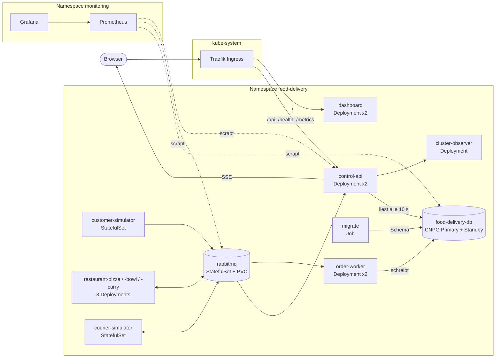

# Komponentendiagramm

Gehört zu [Architektur, Abschnitt 1](architecture.md#1-komponenten). Die
Rollen der einzelnen Komponenten stehen dort in der Tabelle.

```mermaid
flowchart LR
    Browser(["Browser"])

    subgraph ks["kube-system"]
        Traefik["Traefik Ingress"]
    end

    subgraph fd["Namespace food-delivery"]
        Dashboard["dashboard<br/>Deployment x2"]
        API["control-api<br/>Deployment x2"]
        Observer["cluster-observer<br/>Deployment"]
        MQ[("rabbitmq<br/>StatefulSet + PVC")]
        Customer["customer-simulator<br/>StatefulSet"]
        Restaurants["restaurant-pizza / -bowl / -curry<br/>3 Deployments"]
        Courier["courier-simulator<br/>StatefulSet"]
        OrderW["order-worker<br/>Deployment x2"]
        Migrate["migrate<br/>Job"]
        DB[("food-delivery-db<br/>CNPG Primary + Standby")]
    end

    subgraph mon["Namespace monitoring"]
        Prom["Prometheus"]
        Graf["Grafana"]
    end

    Browser --> Traefik
    Traefik -->|"/"| Dashboard
    Traefik -->|"/api, /health, /metrics"| API
    API -->|"SSE"| Browser
    API --> Observer
    Customer --> MQ
    Restaurants <--> MQ
    Courier <--> MQ
    MQ --> OrderW
    MQ --> API
    OrderW -->|"schreibt"| DB
    API -->|"liest alle 10 s"| DB
    Migrate -->|"Schema"| DB
    Prom -.->|"scrapt"| API
    Prom -.->|"scrapt"| MQ
    Prom -.->|"scrapt"| DB
    Graf --> Prom
```
